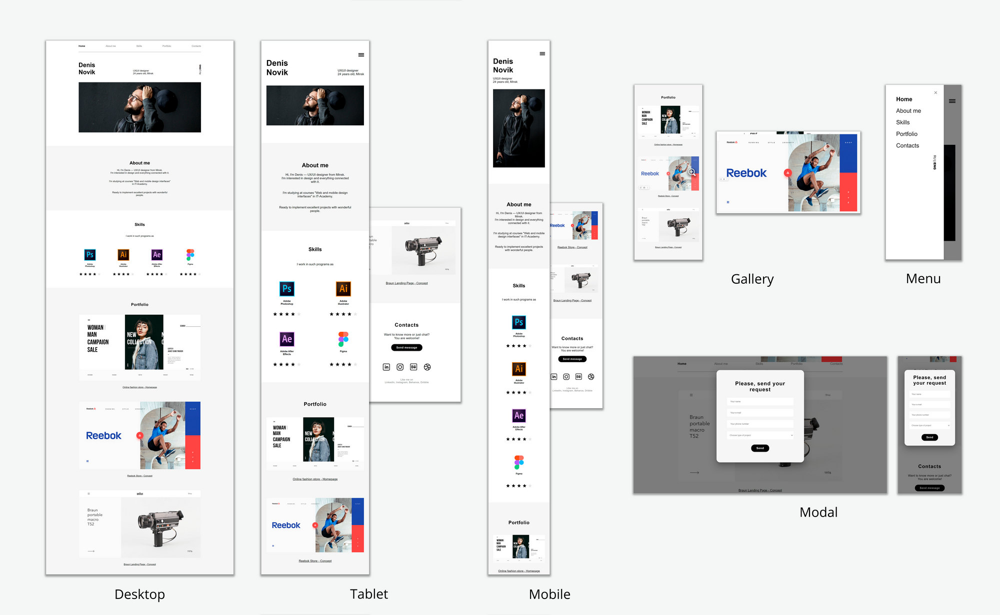

# Сайт-портфолио для UX|UI дизайнера

Одностраничный сайт-портфолио для UX|UI дизайнера (учебный проект)

## Стек технологий:
- HTML5
- CSS3
- CSS Flexbox
- CSS Grid
- Адаптивная и отзывчивая верстка
- Анимация на CSS
- Фреймфорк Materialize CSS (меню-бургер, модальное окно, всплывающие изображения в портфолио)

Сайт доступен на хостинге [GitHub Pages](https://yuliyaatrashkevich.github.io/Portfolio-website/).